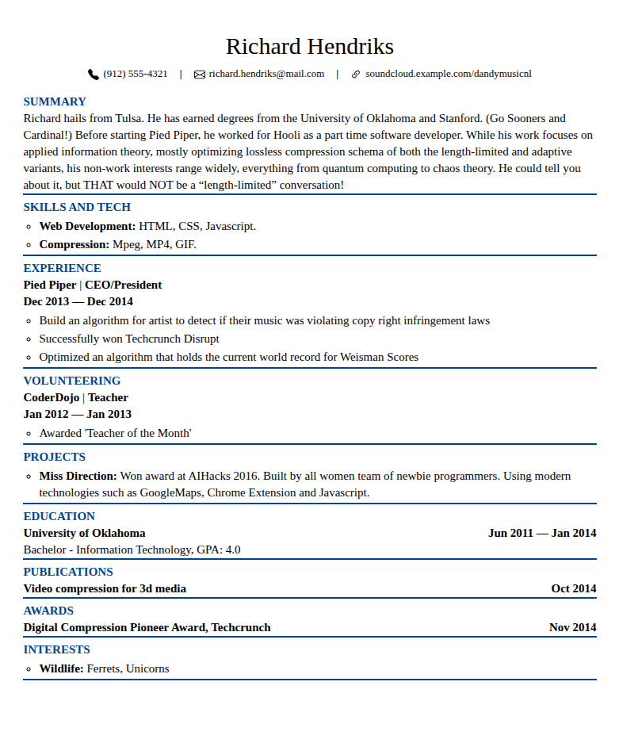

# jsonresume-theme-straightforward (Modified Fork)

A straightforward [jsonresume](https://github.com/jsonresume) theme.

**Note:** This is a fork of the original [jsonresume-theme-straightforward](https://github.com/slugstack/jsonresume-theme-straightforward) with some modifications and personal preferences.

## Preview



## Changes from Original

### Header/Basics Section

- Centered layout with name at the top
- Contact information (phone, email, social profiles) in a single centered line
- SVG icons for phone, email, LinkedIn, and GitHub
- Social profiles display actual URLs (e.g., `linkedin.com/in/username`) instead of platform names
- Location only shows comma when city is present

### Work Experience Section

- Two-line header layout:
  - Line 1: `Organization | Title`
  - Line 2: `Date range`

### Print/PDF

- Job blocks avoid splitting when possible
- Orphan/widow control for better page breaks

### Icon Support

- Supports custom SVG icons in the `icons/` folder
- Icons are inlined for portability

## examples

- [as HTML (https://slugstack.github.io/jsonresume-theme-straightforward)](https://slugstack.github.io/jsonresume-theme-straightforward)
- [as PDF (docs/index.pdf)](docs/index.pdf)

## usage

```sh
npm install jsonresume-theme-straightforward

resume export resume.pdf --format pdf --theme jsonresume-theme-straightforward
resume export resume.html --format html --theme jsonresume-theme-straightforward
```

## building local

```sh
npm install
npm start
npm test

npm run export:html
```

Note that running `npm run export:pdf` will result in a different binary every time it's run, even if the source hasn't changed. So it's not the most reliable indicator of differences.
